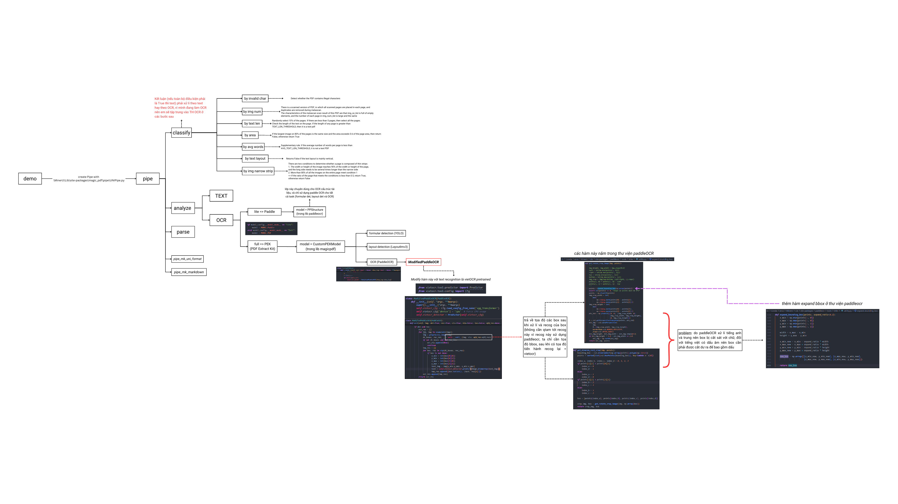

# MinerU

## Project Overview

MinerU is a powerful tool designed to convert PDF documents into machine-readable formats such as Markdown and JSON, enabling seamless extraction and transformation into various formats. Initially developed during the pre-training phase of [InternLM](https://github.com/InternLM/InternLM), MinerU aims to tackle challenges related to symbol conversion in scientific literature. This project contributes to the advancement of large-scale models and supports technological growth in data processing.

The *Mely* version of MinerU is specially tailored for converting PDF content into Markdown in Vietnamese, paving the way for future implementations of Retrieval-Augmented Generation (RAG).

### Workflow Overview
Through extensive testing with various types of Vietnamese PDFs, we found that MinerU performs effectively with text-based PDFs. However, its performance in OCR tasks was found lacking. As a result, we focused on enhancing PaddleOCR to better handle Vietnamese text.

The diagram below outlines the process flow for modifying and converting Vietnamese PDF OCR content within MinerU:

  

## Installation Guide

To begin using MinerU, please refer to the detailed installation guide provided in the [original repository](https://github.com/opendatalab/MinerU).